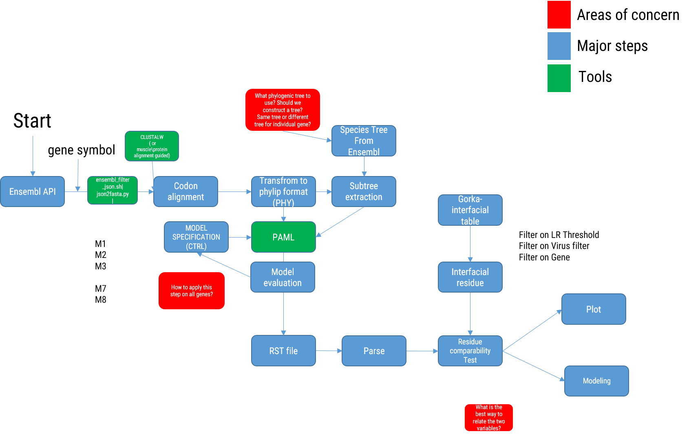

# PAMLer

PAML on steroids, basically. 

With this pipeline, we want to compute site-specific dn/ds for ~4000 genes that have interfacial residues interacting with virus. 

Contributors: Kernyu and Albert

# Objective

Make the following pipeline

# How to use it

* Install `jq` first

    # Download CCR5 cdna using ENSMBL API
    $bash src/ensembl_filter_json.sh CCR5 cdna | python src/json2fasta.py
    # Download CCR5 protein using ENSMBL API
    $bash src/ensembl_filter_json.sh CCR5 protein | python src/json2fasta.py
    
    # Alignment using MUSCLE
    $bash src/ensembl_filter_json.sh CCR5 cdna | python src/json2fasta.py  | muscle -out tmp.fa # this produces a fasta format that is to be parsed and converted to phylip format that can be handled by PAML.
 
    # Parse Multiple Sequence Alignment Results
    $python stop_gap.py CCR5.fa CCR5.phy

    # Generate PAML ctl file
    $bash src/generate_template.ctl.sh <alignment> <tree> <outputfile> > tmp.ctl

# TODO

* [ ] gene --> tidy data for site specific dnds 
    * [ ] alignment format issue: muscle/clustalw produces an alignment
    * [ ] rst parser

