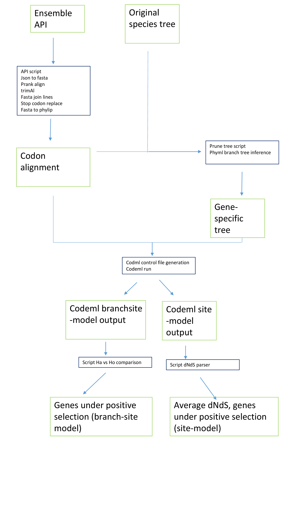

# PAMLer

With this repository, we want to study the selective pressure of ~14000 human genes. Specifically, detect those genes under positive selection in humans compared to other primates, and estimate their dN/dS.

Contributors: Kernyu, Juan and Albert

# Objective

Make the following pipeline



# How to use it

* Install `jq` first

    # Download CCR5 cdna using ENSMBL API
    $bash src/ensembl_filter_json.sh CCR5 cdna | python src/json2fasta.py
    # Download CCR5 protein using ENSMBL API
    $bash src/ensembl_filter_json.sh CCR5 protein | python src/json2fasta.py

 
 # Steps

1. First Download the fasta files using Ensembl API
```
$bash src/ensembl_filter_json.sh <GENE_NAME> cdna | python src/json2fasta.py
```

2. Do translation-aware alignment : Use `prank` to do it

```
ls data/fasta/* | grep --file=20170921-list-genes-that-with-no-alignment.txt | parallel "/Users/akl2140/bin/prank/bin/prank -d={} -o=data/fasta-aligned/{/.}.aligned.fa -translate -F"
```
3. Remove gappy regions, using trimAl ("gappyout" settings)

4. Primate's tree prunning (scripts name?)

5. Estimate branch length for the prunned tree of each gene using PhyML. Fasta file has to be converted into phylip format first.

```
ls data/fasta/*fa | parallel --dry-run "Rscript src/fa2phyinter.R {/.} data/fasta data/phylip && phyml -i data/phylip/{/.}.phy -d nt -b 0 -m GTR -c 4 -a 1 -u  data/pruned_tree/{/.}.tree -o lr" | bash
```
6. Run codeml (branch-site or site model). Input files: i) sequene alignment (phylip format), ii) gene specific tree, iii) contro (ctl) file for codeml. We have uploaded bash scripts to generate the ctl files for either codeml model (assets folder).


## How to extract P values from codeml output (MLC)

```
# Rscript src/codeml-process-pvalue.R <NULL MODEL MLC FILE> <ALTERNATIVE MODEL MLC FILE> 
Rscript src/codeml-process-pvalue.R data/paml_results/A1BG_H0.mlc data/paml_results/A1BG_HA.mlc

```
## How to extract dN/dS table from codeml output?

```
Rscript src/codeml-process-table-site-class.R <MLC FILE> # will produce csv output
```

